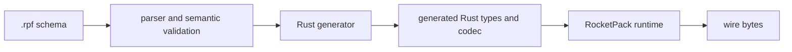

# RocketPack 設計

## 1. このドキュメントについて

本書は、`core-rs` にある RocketPack の Rust runtime、`.rpf` compiler、生成コードの責務と不変条件を扱う。
対象読者は、schema 言語、codec、Rust generator を変更する実装者と reviewer である。

### 1.1 文書間の責務分担

| 文書または正本 | 受け持つもの |
| --- | --- |
| 本書 | RocketPack の責務境界、不変条件、設計判断、実装状況 |
| `ISSUES.md`（未作成） | コードで確認した明確な不具合が生じた場合の作業用一覧 |
| [entrypoints/rocketpack-compiler](../entrypoints/rocketpack-compiler) | `.rpf` の構文、意味検査、Rust code generation の実装 |
| [modules/rocketpack](../modules/rocketpack) | wire codec と生成コードが利用する runtime API の実装 |
| [entrypoints/rocketpack-compiled-example/rpfs](../entrypoints/rocketpack-compiled-example/rpfs) | 生成例が利用する `.rpf` schema の正本 |

### 1.2 本書の時制について

本文は合意済みの完成形を現在形で記述する。
実装状況と残作業は §7 に集約する。
いま何が動くのかを知りたい場合は §7 を先に読む。

## 2. RocketPack とは

RocketPack は、`.rpf` schema から Rust のデータ型と wire codec を生成する仕組みである。
schema は wire 上の field tag と型を定め、runtime は CBOR 互換の長さ表現を読み書きする。

### 2.1 スコープ外

- C# と Swift の generator は対象外であるため、本書はそれらの生成 API と検証方式を定めない。
- message 全体の byte 数、総要素数、nest 深度は codec または transport の別制約とし、field ごとの長さ制約へ集約しない。
- `core-rs` 以外にある `.rpf` の移行は各 repository が所有するため、本書は repository 間の同期機構を持たない。

## 3. 全体構成

### 3.1 コンポーネントとディレクトリ対応表

| パス | package | 役割 |
| --- | --- | --- |
| [modules/rocketpack](../modules/rocketpack) | `omnius-core-rocketpack` | encoder、decoder、`RocketPackStruct` の runtime contract |
| [entrypoints/rocketpack-compiler](../entrypoints/rocketpack-compiler) | `omnius-core-rocketpack-compiler` | `.rpf` の parse、意味検査、Rust code generation |
| [entrypoints/rocketpack-compiled-example/rpfs](../entrypoints/rocketpack-compiled-example/rpfs) | 該当なし | 生成例の schema 正本 |
| [entrypoints/rocketpack-compiled-example/rust/gen](../entrypoints/rocketpack-compiled-example/rust/gen) | `rocketpack-compiled-example` | compiler が出力する Rust code であり、手で編集しない |

### 3.2 処理の流れ

schema の制約は compiler が一度解決し、生成コードと runtime の境界検査へ反映する。

## 4. 中心概念

### 4.1 Schema

**Schema** は `.rpf` に記述した package、型、field tag、定数、制約の集合である。
`.rpf` が正本であり、生成された Rust code は schema から再生成できる派生成果物である。

### 4.2 可変長型の制約

**可変長型の制約** は、`string`、`bytes`、`Vec`、`Map` の各値が取り得る長さの包含範囲である。
`string` と `bytes` は byte 数、`Vec` は要素数、`Map` は wire 上の entry 数を長さとする。
`Option` は値の有無だけを表し、固定長 array は外側の長さが型で決まるため、それぞれ内包する可変長型だけが制約を持つ。

制約は各出現箇所で任意である。
制約を書かない可変長型を **制約なしの可変長型** と呼び、schema はその値の長さを制限しない。
制約なしの可変長型に残る唯一の上限は、decoder が入力の残り byte 数に対して行う検査（§5.2）である。

## 5. 制約の検査境界

### 5.1 Schema compile 時

compiler は field tag と enum variant tag の重複、type alias 内の制約、default literal を生成前に検査する。
tag の重複は struct の field、enum の variant、record variant 内の field のそれぞれで検査する。
制約を書いた出現箇所については、加えて有限な上限、境界値の解決、範囲の順序を検査する。
どの schema にも不正があれば、生成物を書き出す前に失敗する。

### 5.2 Codec 実行時

生成される field は `String`、`Vec`、`BTreeMap` などの標準 Rust 型を保つ。
encode は length prefix を書く前に検査し、decode は collection の確保、反復、payload の所有化より前に宣言長を検査する。
制約違反は schema path と実際の長さを持つ専用 error として返す。

制約の有無に関わらず、decoder は array と map の宣言長が入力の残り byte 数に収まることを検査する。
この検査は schema 由来の制約ではなく wire の整合性に属するため、schema path を持たない `UnexpectedEof` として返す。

## 6. 設計判断

### 6.1 決定済み

#### 有限な包含レンジを可変長型へ任意で後置する

**決定**
`string`、`bytes`、`Vec`、`Map` の各出現箇所は `[..=max]` または `[min..=max]` を後置できる。
範囲を書かない出現箇所は制約なしの可変長型となり、schema は長さを制限しない。
範囲を書く場合は包含かつ有限に限り、上限なしと排他的上限を認めない。
制約は nest 内でも各可変長型へ個別に置く。

**理由**
型に制約を結び付けると、外側と内側のどちらへ適用するかが構文上明確になり、範囲を書いた箇所の有限な最大値を compiler が一律に検査できる。
上限を定める根拠がない値にまで範囲を強いると、schema 作者は根拠のない数値を書くことになり、制約が書かれている事実そのものが contract として信用できなくなる。
括弧の有無で「上限を定めた」と「定めていない」が読み分けられるため、任意にしても曖昧さは生じない。

**却下案**
すべての出現箇所へ範囲を必須とする案は、上記の理由により採用しない。
`[..]` のような無制限を表す明示構文は、括弧の省略と同義の表記を増やすため採用しない。
`[min..]` のような下限のみの範囲は、両端を前提とする既存の runtime API と生成コードの分岐を増やす一方、必要な場合は `[min..=max]` で表現できるため採用しない。
生成器の設定で必須と任意を切り替える案は、同じ `.rpf` の可否が設定に依存し、schema が正本でなくなるため採用しない。
field attribute は nest 内の対象指定が複雑になるため採用しない。
名前付き generic 引数は型引数と設定値が混在するため採用しない。
bounded wrapper 型は生成 API を重くするため採用しない。

#### 標準 Rust 型を codec 境界で検査する

**決定**
生成 field の標準 Rust 型を維持し、encode と decode の両方で制約を検査する。

**理由**
既存の利用側 API を保ちながら、local に構築した不正値の送信と、wire から受け取った不正値の利用を同じ contract で拒否できる。

**却下案**
decode だけの検査は local の不正値を wire へ出力できるため採用しない。
構築時に不正値を表現できない wrapper 型は既存 field 型を変えるため採用しない。

#### 宣言長が残り buffer に収まることを decoder が検査する

**決定**
`read_array` と `read_map` は、読み取った宣言長が入力の残り byte 数を超える場合に `UnexpectedEof` を返す。
この検査は schema の制約とは独立に働き、制約なしの可変長型にも、runtime API を直接呼ぶ利用側にも適用される。

**理由**
array と map の宣言長は wire 上で 8 byte まで取り得るため、9 byte の入力が `u64::MAX` 個の要素を宣言できる。
生成される decode は宣言長を容量として collection を確保するので、この検査がないと入力長に比例しない確保を外部から誘発できる。
要素は wire 上で最低 1 byte を占めるため、残り byte 数は要素数の正当な上限であり、正当な入力を一つも拒否しない。
`read_bytes` と `read_string` は payload を入力から切り出す時点で同じ検査を通るため、この決定は array と map だけに残っていた非対称を埋める。

**却下案**
宣言長を残り byte 数で切り詰める案は、不正な入力を error にせず短い値として受理するため採用しない。
生成コード側へ検査を置く案は、runtime API を直接使う呼び出し側を保護せず、同じ検査が生成物へ散らばるため採用しない。
message 全体の byte 数や総要素数の上限を runtime に持たせる案は、[長さ制約を各値へ限定する](#d-per-value-scope) と衝突するため採用しない。

#### Timestamp を runtime 組み込み型として解決する

**決定**
非修飾かつ完全一致の `Timestamp64` と `Timestamp96` は予約済みの組み込み型とし、大小文字が異なる表記を alias として認めない。
struct、enum、type alias、import の短い名前が予約名と衝突する schema は compile error とする。
修飾付きの同名型は外部型として扱い、予約名ではない alias を付けた import を認める。
組み込み timestamp は field、enum payload、type alias、`Option`、`Vec`、`Map` の key と value、固定長 array の型位置で利用できる。
Rust generator はそれぞれ `omnius_core_rocketpack::primitive::Timestamp64` と `omnius_core_rocketpack::primitive::Timestamp96` へ解決し、生成する validate、encode、decode を runtime の `RocketPackStruct` に委譲する。
type alias の解決後に timestamp を含む field の default literal は schema compile 時に拒否する。
runtime wrapper は `Debug`、`Clone`、`PartialEq`、`Eq`、`PartialOrd`、`Ord` だけを実装要件とし、`Timestamp96.nanos` の意味と既存の wire encoding は変更しない。

**理由**
schema と生成 API が timestamp の精度を明示したまま、wire contract の正本を runtime の一か所に保てる。
予約名の衝突を生成前に拒否すると、組み込み型と利用者定義型のどちらへ解決されたかが一意になる。
runtime wrapper の比較 trait は生成型の derive と `BTreeMap` key の要件を満たすために限定する。

**却下案**
大小文字や snake case の別名は、同じ型を表す schema 表記を増やすため採用しない。
`DateTime<Utc>` への暗黙変換は schema 型と生成型の対応を不明瞭にするため採用しない。
generator 内での wire encoding の再実装は runtime と二重管理になるため採用しない。

#### 境界値と type alias の解決範囲を限定する

**決定**
境界値は数値 literal または同じ package の符号なし整数定数とし、定数型は `u8`、`u16`、`u32`、`u64` に限定する。
type alias は宣言内の制約を引き継ぎ、利用側で範囲を後置できない。
宣言内に範囲を書かなかった alias も同じであり、利用側から初めて制約を与えることもできない。
`string` と `bytes` の default literal は schema compile 時に検査する。

**理由**
代表値を再利用できる一方で、式評価と制約合成を schema 言語へ持ち込まずに済む。
alias 名から contract が一意に定まるため、同じ alias が使用箇所ごとに違う長さを許すことがない。

**却下案**
imported const、演算式、負数、alias 利用側の制約上書きは、名前解決と優先順位を増やすため採用しない。
制約なしの alias にだけ利用側の制約を許す案は、alias を解決するまで可否が決まらず、制約合成を裏口から導入するため採用しない。

#### Schema version 1 と wire encoding を維持する

**決定**
可変長制約の導入後も `.rpf` は `version 1;` を使い、wire encoding を変更しない。

**理由**
schema は一般公開されておらず、制約は既存 wire 値へ追加する検証 contract である。

**却下案**
`version 2;` への更新は、wire encoding を変えない内部 schema に移行分岐を増やすため採用しない。

#### 長さ制約を各値へ限定する

**決定**
長さ制約は各可変長値へ適用し、message 全体の byte 数、総要素数、nest 深度を集計しない。

**理由**
field の意味上の上限と、transport または decoder 全体の resource budget は責務が異なる。

**却下案**
合計 size と nest depth の制約は、別の global policy を field 型へ混在させるため採用しない。

#### 制約違反を完全な schema path で報告する

**決定**
encoder と decoder は `LengthOutOfRange` を返し、`Request.tags[]`、`Request.attributes.key`、`Event.Upload.0` のような生成時に決まる schema path を `context` に持つ。

**理由**
呼び出し側とテストが error message の文字列解析に依存せず、nest 内の違反箇所を識別できる。

### 6.2 保留

現在、可変長型の制約について保留している設計論点はない。

## 7. 現状と残作業

可変長型の制約は任意であり、制約あり制約なしのどちらも parser、意味検査、Rust generator、runtime の境界検査へ反映されている。
`Timestamp64` と `Timestamp96` は Rust generator と生成例で利用できる。
§6.1 の決定済み contract に残作業はない。

確認済みの不具合を記録する `ISSUES.md` は現時点で存在しない。
