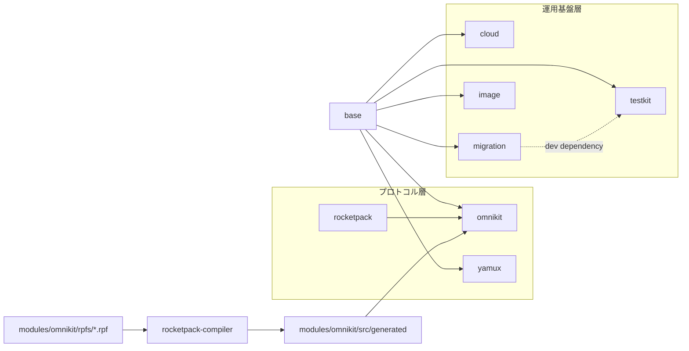
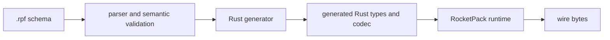
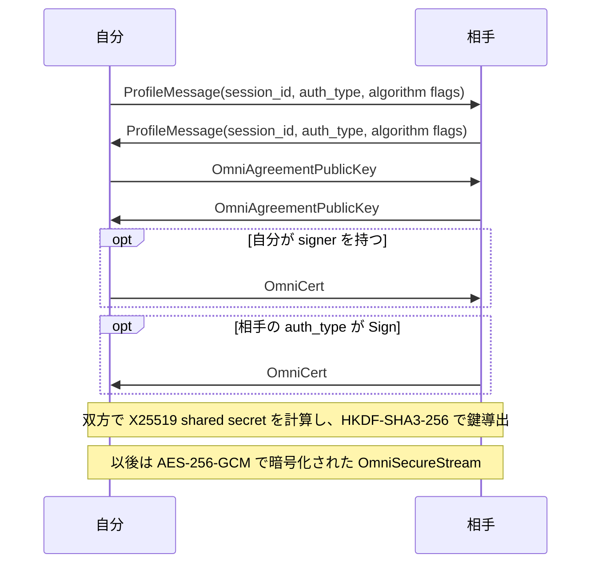

# core-rs 設計書

## 1. このドキュメントについて

本書は、core-rs workspace を構成する各 crate（`omnius-core-*`）と entrypoint の責務境界、不変条件、設計判断、実装状況を扱う。
対象読者は、いずれかの crate や entrypoint を変更する実装者と reviewer である。

### 1.1 文書間の責務分担

| 文書または正本 | 受け持つもの |
| --- | --- |
| 本書 | workspace 全体の構成、crate 間の責務境界、不変条件、設計判断、実装状況 |
| [ISSUES.md](./ISSUES.md) | コードで確認した明確な不具合と起票までの作業用一覧 |
| [RocketPack compiler の設計](./design/rocketpack-compiler.md) | compiler 固有の責務、不変条件、設計判断、実装状況 |
| [entrypoints/rocketpack-compiler](../entrypoints/rocketpack-compiler) | `.rpf` の構文、意味検査、Rust code generation の実装 |
| [modules/rocketpack](../modules/rocketpack) | wire codec と生成コードが利用する runtime API の実装 |
| [modules/omnikit/rpfs](../modules/omnikit/rpfs) | omnikit プロトコルが使う `.rpf` schema の正本 |
| [entrypoints/rocketpack-compiled-example/showcase/rpfs](../entrypoints/rocketpack-compiled-example/showcase/rpfs) | 生成例が利用する `.rpf` schema の正本 |
| [README.md](../README.md) | プロジェクト概要と外部ドキュメントへのリンク |

### 1.2 本書の時制について

本文は合意済みの完成形を現在形で記述する。
実装状況と残作業は §12 に集約する。
いま何が動くのかを知りたい場合は §12 を先に読む。

## 2. core-rs とは

core-rs は、Omnius Labs の各プロダクトが共有する Rust 製 crate 群の workspace である。
独自の wire codec（RocketPack）とその上に構築したセキュアな接続、リモート呼び出し（omnikit）、stream 多重化（yamux）というネットワーク関連の crate 群と、クラウドサービス連携や DB migration などの運用基盤（cloud、migration、testkit）を、それぞれ独立した crate として提供する。

### 2.1 スコープ外

- 各 crate はライブラリであり、単体で動作するサーバーやデーモンの実行 binary を持たない。
  `rocketpack-compiler` だけは schema からコードを生成する CLI として例外的に binary を持つが、これは compile 時ツールであり、実行時に何かを配信する server ではない。
  持たないことで、本書はプロセス起動やデプロイ方式を扱わない。
- omnikit プロトコルを実際に話す P2P node や server の実装は持たない。
  持たないことで、node 発見やネットワークトポロジーの設計は本書の対象外である。
- cloud と migration は、workspace 内の他 crate から利用されていない。
  cloud の `#[ignore]` 付き統合テストが `opxs-dev`、`opxs-batch-email-send-sqs` など外部プロダクト固有のリソース名を含むことから、これらは core-rs の外にある downstream アプリケーションから個別に利用される想定に読める（コード上に明示の記述はない）。
  持たないことで、本書はそれらアプリケーション固有のドメインロジックや認証情報の管理方式を扱わない。
- C# と Swift 向けの RocketPack generator は持たない。
  `rocketpack-compiler` は Rust 向け生成のみを実装する。
  持たないことで、本書は他言語向けの生成 API とその検証方式を定めない。

## 3. 全体構成

### 3.1 コンポーネントとディレクトリ対応表

| パス | package | 役割 |
| --- | --- | --- |
| [modules/base](../modules/base) | `omnius-core-base` | cloud、image、migration、omnikit、testkit、yamux が依存する基盤（`Clock`、`OmniError` contract、file lock、sleeper、tsid など） |
| [modules/rocketpack](../modules/rocketpack) | `omnius-core-rocketpack` | wire codec と `RocketPackStruct` の runtime contract |
| [modules/omnikit](../modules/omnikit) | `omnius-core-omnikit` | RocketPack 上に構築したセキュアな接続とリモート呼び出し（omnikit プロトコル） |
| [modules/yamux](../modules/yamux) | `omnius-core-yamux` | yamux stream 多重化の Tokio 向け wrapper |
| [modules/cloud](../modules/cloud) | `omnius-core-cloud` | AWS（S3、Secrets Manager、SES、SQS）と GCP（Secret Manager）の薄い wrapper |
| [modules/migration](../modules/migration) | `omnius-core-migration` | PostgreSQL と SQLite 向けの自前 migration runner |
| [modules/testkit](../modules/testkit) | `omnius-core-testkit` | 統合テスト用の Docker container 起動 helper |
| [modules/image](../modules/image) | `omnius-core-image` | EXIF metadata 関連の依存関係のみを宣言した crate（詳細は §12） |
| [entrypoints/rocketpack-compiler](../entrypoints/rocketpack-compiler) | `omnius-core-rocketpack-compiler` | `.rpf` の parse、意味検査、Rust code generation を行う CLI |
| [entrypoints/rocketpack-compiled-example](../entrypoints/rocketpack-compiled-example) | 該当なし（workspace から除外） | 生成コードの実例と round trip 検証用の sample project。`showcase`、`provider`、`consumer` の 3 project を同じ構造で並べ、`provider` と `consumer` は manifest 間の path dependency を検証する |

### 3.2 処理の流れ



rocketpack と rocketpack-compiler は base に依存せず、OmniError の contract にも従わない（§4.1）。
yamux は base にのみ依存する独立した crate であり、omnikit の remoting 層とは結線されていない。
remoting 層をどう多重化するかは §11.2 で保留している。

## 4. 中心概念

### 4.1 OmniError

**OmniError** は、crate が自分のエラー型に実装する共通のエラー contract である。
コード上は `omnius_core_base::error::OmniError` という、associated type `ErrorKind` を持つ trait であり、`new`、`from_error`、`with_message`、`kind`、`message`、`backtrace` という API と、既定の `Debug` 形式の `fmt` を持つ。
`cloud`、`migration`、`omnikit`、`testkit`、`yamux` はそれぞれ独立した `crate::error::Error` と `crate::error::ErrorKind` の組を用意してこの trait を実装し、`crate::result::Result<T>` をその `Error` に対する alias として `crate::prelude` から re-export する。
`rocketpack` と `rocketpack-compiler` はこの規約に従わず、`thiserror::Error` で定義した専用の error 型（`RocketPackEncoderError` など）を直接使う。
OmniError は trait であり具体的な型ではないため、workspace 全体で共有される単一の Error 型は存在しない。

### 4.2 RocketPackStruct

**RocketPackStruct** は、値を wire へ pack し、wire から unpack する構造体が実装する contract である。
コード上は `omnius_core_rocketpack::RocketPackStruct` という trait であり、`validate`、`pack`、`unpack`、`import`、`export` を持つ。
`rocketpack-compiler` が生成する Rust 型はすべてこの trait を実装する。
omnikit の remoting 層（`OmniRemotingStream::send` と `recv`）は、この trait を型境界に持つ generic 関数として、生成された任意のメッセージ型を送受信する。
Schema はこの trait の実装を生成させる入力であり、RocketPackStruct は生成された出力側が満たす契約である。

### 4.3 Schema

**Schema** は `.rpf` に記述した package、型、field tag、定数、制約の集合である。
`.rpf` が正本であり、生成された Rust code は schema から再生成できる派生成果物である。
[modules/omnikit/rpfs](../modules/omnikit/rpfs) と [entrypoints/rocketpack-compiled-example/showcase/rpfs](../entrypoints/rocketpack-compiled-example/showcase/rpfs) は、それぞれ omnikit プロトコルと生成例が使う schema の正本である。

### 4.4 可変長型の制約

**可変長型の制約** は、`string`、`bytes`、`Vec`、`Map` の各値が取り得る長さの包含範囲である。
`string` と `bytes` は byte 数、`Vec` は要素数、`Map` は wire 上の entry 数を長さとする。
`Option` は値の有無だけを表し、固定長 array は外側の長さが型で決まるため、それぞれ内包する可変長型だけが制約を持つ。
制約は各出現箇所で任意である。
制約を書かない可変長型を **制約なしの可変長型** と呼び、schema はその値の長さを制限しない。
制約なしの可変長型に残る唯一の上限は、decoder が入力の残り byte 数に対して行う検査（§5.3）である。

## 5. RocketPack

RocketPack は、`.rpf` schema から Rust のデータ型と wire codec を生成する仕組みである。
schema は wire 上の field tag と型を定め、runtime は CBOR 互換の長さ表現を読み書きする。
message 全体の byte 数、総要素数、nest 深度は codec または transport の別制約とし、field ごとの長さ制約へは集約しない（§11.1 の[長さ制約を各値へ限定する](#d-per-value-scope)を参照）。
core-rs 以外にある `.rpf` の移行は各 repository が所有し、core-rs は repository 間の同期機構を持たない。

### 5.1 コンポーネントとディレクトリ対応表

| パス | package | 役割 |
| --- | --- | --- |
| [modules/rocketpack](../modules/rocketpack) | `omnius-core-rocketpack` | encoder、decoder、`RocketPackStruct` の runtime contract |
| [entrypoints/rocketpack-compiler](../entrypoints/rocketpack-compiler) | `omnius-core-rocketpack-compiler` | `.rpf` の parse、意味検査、Rust code generation |
| [modules/omnikit/rpfs](../modules/omnikit/rpfs) | 該当なし | omnikit プロトコルが使う schema の正本 |
| [modules/omnikit/rocketpack.yaml](../modules/omnikit/rocketpack.yaml) | 該当なし | omnikit の schema module manifest。`rpfs` 配下の全 `.rpf` を [modules/omnikit/src/generated](../modules/omnikit/src/generated) へ生成する |
| [gen-rocketpack.sh](../gen-rocketpack.sh) | 該当なし | repository root から `rocketpack-compiler` を実行して omnikit の生成コードを更新する script |
| [entrypoints/rocketpack-compiled-example/showcase/rpfs](../entrypoints/rocketpack-compiled-example/showcase/rpfs) | 該当なし | 生成例が利用する schema の正本 |
| [entrypoints/rocketpack-compiled-example/showcase/rust/gen](../entrypoints/rocketpack-compiled-example/showcase/rust/gen) | `rocketpack-showcase` | compiler が出力する Rust code であり、手で編集しない |



schema の制約は compiler が一度解決し、生成コードと runtime の境界検査へ反映する。
`rocketpack-compiler` の generator dispatch は、plugin id が `rocketpack-rust` の場合だけ実際に生成する。
`rocketpack-csharp` と `rocketpack-swift` は認識はするが、生成せずに log を出して skip する。

### 5.2 Schema compile 時

compiler は field tag と enum variant tag の重複、type alias 内の制約、default literal を生成前に検査する。
tag の重複は struct の field、enum の variant、record variant 内の field のそれぞれで検査する。
制約を書いた出現箇所については、加えて有限な上限、境界値の解決、範囲の順序を検査する。
どの schema にも不正があれば、生成物を書き出す前に失敗する。

### 5.3 Codec 実行時

生成される field は `String`、`Vec`、`BTreeMap` などの標準 Rust 型を保つ。
encode は length prefix を書く前に検査し、decode は collection の確保、反復、payload の所有化より前に宣言長を検査する。
制約違反は schema path と実際の長さを持つ専用 error として返す。
制約の有無に関わらず、decoder は array と map の宣言長が入力の残り byte 数に収まることを検査する。
この検査は schema 由来の制約ではなく wire の整合性に属するため、schema path を持たない `UnexpectedEof` として返す。

## 6. omnikit

omnikit は、RocketPack で定義した message（[modules/omnikit/rpfs](../modules/omnikit/rpfs)）の上に、鍵交換と認証付き暗号化を行うセキュアな接続と、関数単位のリモート呼び出しを構築する crate である。

### 6.1 層構造

呼び出し側が用意する raw な `T: AsyncRead + AsyncWrite`（TCP や `tokio::io::duplex` など）の上に、次の層を積む。

```
layer 4: remoting (service/remoting)
         HelloMessage handshake と RocketPackStruct message の送受信
----------------------------------------------------------------------
layer 3: secure connection (service/connection/secure)
         X25519 鍵交換 + HKDF + AES-256-GCM
----------------------------------------------------------------------
layer 2: framed codec (service/connection/codec)
         length delimited framing
----------------------------------------------------------------------
layer 1: raw AsyncRead + AsyncWrite（呼び出し側が用意）
```

各層は下の層に対する generic 関数として実装されているため、型のうえでは自由に組み合わせられる。

### 6.2 secure connection

`service/connection/secure/auth.rs` の `Authenticator::auth` が handshake 全体を実装する。



相手の認証は、相手が申告した `auth_type` にのみ依存する。
自分が signer を持っていても、相手が `AuthType::None` を送れば相手の証明書は要求されない。
双方が相手に認証を強制するかどうかは各々の設定次第であり、mutual 認証を型として強制する仕組みはない。

鍵交換と鍵導出は次のとおりである。

- 鍵交換は X25519（`x25519_dalek`）のみを実装する。
  `ProfileMessage` の algorithm flags は bitmask で複数候補を表現できるが、実装がある候補は各 category につき 1 つだけであり、一致しない場合は `ErrorKind::UnsupportedType` になる。
- 鍵導出は「`自分の session_id` XOR `相手の session_id`」を salt に使う HKDF-SHA3-256 であり、AES-256-GCM の鍵と nonce を送受信それぞれ独立に 1 組ずつ導出する。
- handshake（`ProfileMessage`、`OmniAgreementPublicKey`、`OmniCert`）は平文で送られ、`Authenticator::auth` 完了後にだけ `OmniSecureStream` が AES-256-GCM で読み書きを暗号化する。
- handshake に失敗した場合、`auth()` は `Err` を返すだけであり、相手へ失敗を伝える message は送らない。
  呼び出し側は下位 transport を close する前提になる。
- `OmniSecureStream::new` に渡す `max_frame_length` は handshake 中の平文 frame にだけ働く。
  handshake 後の暗号化 stream 自体の frame 分割は `secure/stream.rs` に定めた固定 64 KiB を使い、呼び出し側が指定した `max_frame_length` には従わない。

**AEAD の nonce は wire に載らず、送受信ごとに独立した counter を 1 message ごとに決定的に増分することでのみ一意性を保つ。**
この前提は、下位 stream が順序を保証する reliable な stream であることに依存する。
順序が保証されない下位 stream の上で使うと、両端の counter が同期せず decrypt が破綻する。

### 6.3 remoting

`OmniRemotingCaller`（呼び出し側）と `OmniRemotingListener`（受け側）は、1 つの下位 stream につき 1 回の関数呼び出しだけを扱う。
`OmniRemotingCaller::new` は stream を送受信半分に分割し、`HelloMessage { version, function_id }` を送って `OmniRemotingCaller` を返す。
呼び出し側はその `call_stream()` から `OmniRemotingStream` を取得し、送受信に使う。
`OmniRemotingListener::new` は同じ `HelloMessage` を検証し、`function_id()` として呼び出し先を露出したうえで、`listen_stream(callback)` に `OmniRemotingStream` を渡して callback を 1 回呼ぶ。
どの関数を呼ぶかを `function_id` から実際に分岐する処理は、このリモート層の外側（呼び出し側の実装）が担う。
1 回の呼び出しが 1 つの stream を専有するこの形は、1 つの secure connection 上で複数の呼び出しを同時に扱う用途には向かない（多重化の方式は §11.2 で保留している）。

### 6.4 model

`model/omni_hash.rs`、`omni_sign.rs`、`omni_agreement.rs` は、同名の `.rpf`（[modules/omnikit/rpfs](../modules/omnikit/rpfs)）から生成された `OmniHash`、`OmniSigner`、`OmniCert`、`OmniAgreement*` という wire 構造体へ、業務ロジックを直接 `impl` する。
別の wrapper 型は用意しない。

**型を参照する唯一の path は `generated` 側であり、`model` 側の module は再 export しない。**
`crate` 内外を問わず `generated::omni_sign::OmniSigner` のように参照する。
Rust の inherent impl と trait impl は module path ではなく型に紐づくため、`impl` の記述場所が `model` 側であっても、`generated` 側の path から掴んだ型にそのまま付いてくる。
この 3 つの `model` module は `impl` の置き場でしかなく、参照されないことを保証するために [model.rs](../modules/omnikit/src/model.rs) では非公開の `mod` として宣言する。
生成器が `src/generated` 以下を丸ごと差し替え、`// @generated by rocketpack-compiler` で始まらないファイルの上書きを拒否する（[codegen/rust.rs](../entrypoints/rocketpack-compiler/src/codegen/rust.rs) の `validate_managed_target`）ため、手書きの `impl` を生成物と同じ directory へ置くことはできない。
`.rpf` の package 名、`src/generated` 直下の module 名、`model` 直下の module 名は同一である。
`OmniHash::compute_hash` は SHA3-256、`OmniSigner::sign` と `OmniCert::verify` は Ed25519（`ed25519_dalek`）、`OmniAgreement::gen_secret` は X25519（`x25519_dalek`）を使う。
`OmniHash`、`OmniSigner`、`OmniCert` の `Display` は、[service/converter/omni_base.rs](../modules/omnikit/src/service/converter/omni_base.rs) の `OmniBase`（multibase 準拠の `f` が hex、`u` が base64url encoding）を経由する。
`OmniHash` は `sha3_256:u<base64url>`、`OmniSigner` と `OmniCert` は `{name}@u<base64url(sha3_256(public_key))>` のような人間可読な文字列を生成する。

`model/omni_addr.rs` の `OmniAddr` だけは対応する生成型を持たない、手書きの値型であり、`model` 直下で公開 module として残るのもこれだけである。
`tcp(ip4(...),port)` のような s 式風の記法を `nom` で parse し、endpoint を表す。
`OmniBase` や暗号鍵とは無関係であり、名前が似ている以外の関係はない。

## 7. yamux

`omnius-core-yamux` は、外部 crate `yamux`（stream 多重化そのものの実装）を、channel を介した actor 駆動の非同期 API として包む wrapper である。
frame や window、stream 状態の管理はすべて外部 crate 側が持ち、この crate は次の 2 点だけを足す。

- `YamuxConnection::new` が背後の driver task を `tokio::spawn` し、呼び出し側は poll を意識しない。
- `connect_stream` と `accept_stream` は `&self` であり、複数の task から並行に呼び出せる。
  実際の `yamux::Connection` への変更は driver task だけが行い、呼び出し側は channel 越しに依頼する。

`YamuxConnection::new<S>` は `S: AsyncRead + AsyncWrite + Send + Unpin + 'static` を要求する generic であり、下位 transport の型を問わない。
`close()` は shutdown 信号を送って driver task の終了を待つ、graceful な close である。
`Drop` は非 blocking な fallback であり、driver task を待たずに abort するため、graceful な close が必要な場合は `close().await` を明示的に呼ぶ必要がある。

## 8. cloud

`omnius-core-cloud` は、AWS（S3、Secrets Manager、SES、SQS）と GCP（Secret Manager）の SDK client を、小さな trait と `*Impl` 構造体の組として包む wrapper である。
各機能は同じ形（trait と、実 client を保持する `*Impl`、一部は `*Mock`）を独立に繰り返す。
共通の親 trait や marker は存在せず、AWS 側の `SecretsReader` と GCP 側の `SecretReader` のように、同じ役割でも trait 名と署名が別々に定義される。
両者を統一して cloud を切り替える呼び出し側コードを書くには、利用側で独自の統一 trait を用意する必要がある。

mock は呼び出しの記録と応答の再生に徹する。
入力は `Arc<parking_lot::Mutex<Vec<Input>>>` に記録され、戻り値のある method は `Arc<Mutex<VecDeque<T>>>` から `pop_front` する（尽きれば既定値を返す）。
実際のストレージやキューを模した状態は持たない。

GCP の `SecretReaderImpl::read_value` は呼び出しのたびに新しい API client を生成する。
AWS 側の各 `*Impl` は呼び出し側が構築して保持した `Client` を使い回す。

`aws` feature と `gcp` feature はそれぞれ独立して有効化でき、無効な側の依存 crate はコンパイルに含めない。

## 9. migration

`omnius-core-migration` は、`sqlx::migrate!` を使わず、PostgreSQL と SQLite それぞれに手書きした migration runner である。
history table への記録により、同じ migration を再実行しても再適用しない冪等性を持つ。

PostgreSQL（`postgres.rs`、`PostgresMigrator`）は次の手順で動く。

1. `_migrations`（適用済み file 名）と `_semaphores`（実行中を示す排他行）を作成する。
2. migration file を格納した directory を読み、file 名の辞書順を実行順として使う。
3. 未適用の file がなければ、lock を取らずに終了する。
4. `_semaphores` へ自分の `username` を primary key として insert する lock を取る。
   既に同じ `username` の行があれば insert は失敗する。
5. 未適用の file ごとに transaction を開き、`tokio_postgres::batch_execute` で file 全体を実行し、history へ記録して commit する。
   1 file が atomic な単位になる。
6. 成功しても失敗しても `_semaphores` の行を delete して lock を解放する。

**この lock は `pg_advisory_lock` ではなく、`_semaphores` table への insert と delete による自前の実装である。**
プロセスが lock 取得後に crash すると、`_semaphores` の行は TTL も自動 cleanup も持たないため、次回以降の migration がその `username` に対して lock を取れなくなるという前提の崩れ方をする。

SQLite（`sqlite.rs`、`SqliteMigrator`）は PostgreSQL と実行 engine から異なる。

- `sqlx::SqlitePool` を使う。
  PostgreSQL 側は `tokio_postgres` を直接使い、`sqlx` を経由しない。
- migration の供給元は directory ではなく、呼び出し側が組み立てて渡す `Vec<MigrationRequest>` である。
  順序は Vec の順そのままであり、file 名によるソートは行わない。
- `_semaphores` に相当する排他機構は持たない。
- 1 file 分の SQL を `';'` で単純分割してから 1 文ずつ実行する。
  文字列 literal やコメントの中の `;` は区別しないため、それらを含む SQL に対しては分割が意図と異なりうる。

[modules/testkit](../modules/testkit) を使う `tests/postgres.rs` は、Docker 上の実 PostgreSQL に対して migration の成功、構文 error での失敗、二重実行時の冪等性を検証する。
このテストは `stable-test` と `postgres` の両 feature を有効にした場合だけ build される。

## 10. testkit

`omnius-core-testkit` は、統合テストが使う Docker container を起動する helper である。
`containers::postgres::PostgresContainer` は、`testcontainers` crate で `postgres` image を起動し、起動完了を示す log message を待ってから接続文字列を組み立てる。

## 11. 設計判断

### 11.1 決定済み

<a id="d-rpf-length-syntax"></a>
#### 有限な包含レンジを可変長型へ任意で後置する

**決定**
`string`、`bytes`、`Vec`、`Map` の各出現箇所は `[..=max]` または `[min..=max]` を後置できる。
範囲を書かない出現箇所は制約なしの可変長型となり、schema は長さを制限しない。
範囲を書く場合は包含かつ有限に限り、上限なしと排他的上限を認めない。
制約は nest 内でも各可変長型へ個別に置く。

**理由**
型に制約を結び付けると、外側と内側のどちらへ適用するかが構文上明確になり、範囲を書いた箇所の有限な最大値を compiler が一律に検査できる。
上限を定める根拠がない値にまで範囲を強いると、schema 作者は根拠のない数値を書くことになり、制約が書かれている事実そのものが contract として信用できなくなる。
括弧の有無で「上限を定めた」と「定めていない」が読み分けられるため、任意にしても曖昧さは生じない。

**却下案**
すべての出現箇所へ範囲を必須とする案は、上記の理由により採用しない。
`[..]` のような無制限を表す明示構文は、括弧の省略と同義の表記を増やすため採用しない。
`[min..]` のような下限のみの範囲は、両端を前提とする既存の runtime API と生成コードの分岐を増やす一方、必要な場合は `[min..=max]` で表現できるため採用しない。
生成器の設定で必須と任意を切り替える案は、同じ `.rpf` の可否が設定に依存し、schema が正本でなくなるため採用しない。
field attribute は nest 内の対象指定が複雑になるため採用しない。
名前付き generic 引数は型引数と設定値が混在するため採用しない。
bounded wrapper 型は生成 API を重くするため採用しない。

<a id="d-codec-boundary-enforcement"></a>
#### 標準 Rust 型を codec 境界で検査する

**決定**
生成 field の標準 Rust 型を維持し、encode と decode の両方で制約を検査する。

**理由**
既存の利用側 API を保ちながら、local に構築した不正値の送信と、wire から受け取った不正値の利用を同じ contract で拒否できる。

**却下案**
decode だけの検査は local の不正値を wire へ出力できるため採用しない。
構築時に不正値を表現できない wrapper 型は既存 field 型を変えるため採用しない。

<a id="d-declared-length-within-buffer"></a>
#### 宣言長が残り buffer に収まることを decoder が検査する

**決定**
`read_array` と `read_map` は、読み取った宣言長が入力の残り byte 数を超える場合に `UnexpectedEof` を返す。
この検査は schema の制約とは独立に働き、制約なしの可変長型にも、runtime API を直接呼ぶ利用側にも適用される。

**理由**
array と map の宣言長は wire 上で 8 byte まで取り得るため、9 byte の入力が `u64::MAX` 個の要素を宣言できる。
生成される decode は宣言長を容量として collection を確保するので、この検査がないと入力長に比例しない確保を外部から誘発できる。
要素は wire 上で最低 1 byte を占めるため、残り byte 数は要素数の正当な上限であり、正当な入力を一つも拒否しない。
`read_bytes` と `read_string` は payload を入力から切り出す時点で同じ検査を通るため、この決定は array と map だけに残っていた非対称を埋める。

**却下案**
宣言長を残り byte 数で切り詰める案は、不正な入力を error にせず短い値として受理するため採用しない。
生成コード側へ検査を置く案は、runtime API を直接使う呼び出し側を保護せず、同じ検査が生成物へ散らばるため採用しない。
message 全体の byte 数や総要素数の上限を runtime に持たせる案は、[長さ制約を各値へ限定する](#d-per-value-scope) と衝突するため採用しない。

<a id="d-timestamp-builtins"></a>
#### Timestamp を runtime 組み込み型として解決する

**決定**
非修飾かつ完全一致の `Timestamp64` と `Timestamp96` は予約済みの組み込み型とし、大小文字が異なる表記を alias として認めない。
struct、enum、type alias、import の短い名前が予約名と衝突する schema は compile error とする。
修飾付きの同名型は外部型として扱い、予約名ではない alias を付けた import を認める。
組み込み timestamp は field、enum payload、type alias、`Option`、`Vec`、`Map` の key と value、固定長 array の型位置で利用できる。
Rust generator はそれぞれ `omnius_core_rocketpack::primitive::Timestamp64` と `omnius_core_rocketpack::primitive::Timestamp96` へ解決し、生成する validate、encode、decode を runtime の `RocketPackStruct` に委譲する。
type alias の解決後に timestamp を含む field の default literal は schema compile 時に拒否する。
runtime wrapper は `Debug`、`Clone`、`PartialEq`、`Eq`、`PartialOrd`、`Ord` だけを実装要件とし、`Timestamp96.nanos` の意味と既存の wire encoding は変更しない。

**理由**
schema と生成 API が timestamp の精度を明示したまま、wire contract の正本を runtime の一か所に保てる。
予約名の衝突を生成前に拒否すると、組み込み型と利用者定義型のどちらへ解決されたかが一意になる。
runtime wrapper の比較 trait は生成型の derive と `BTreeMap` key の要件を満たすために限定する。

**却下案**
大小文字や snake case の別名は、同じ型を表す schema 表記を増やすため採用しない。
`DateTime<Utc>` への暗黙変換は schema 型と生成型の対応を不明瞭にするため採用しない。
generator 内での wire encoding の再実装は runtime と二重管理になるため採用しない。

<a id="d-bound-resolution"></a>
#### 境界値と type alias の解決範囲を限定する

**決定**
境界値は数値 literal または同じ package の符号なし整数定数とし、定数型は `u8`、`u16`、`u32`、`u64` に限定する。
type alias は宣言内の制約を引き継ぎ、利用側で範囲を後置できない。
宣言内に範囲を書かなかった alias も同じであり、利用側から初めて制約を与えることもできない。
`string` と `bytes` の default literal は schema compile 時に検査する。

**理由**
代表値を再利用できる一方で、式評価と制約合成を schema 言語へ持ち込まずに済む。
alias 名から contract が一意に定まるため、同じ alias が使用箇所ごとに違う長さを許すことがない。

**却下案**
imported const、演算式、負数、alias 利用側の制約上書きは、名前解決と優先順位を増やすため採用しない。
制約なしの alias にだけ利用側の制約を許す案は、alias を解決するまで可否が決まらず、制約合成を裏口から導入するため採用しない。

<a id="d-schema-version"></a>
#### Schema version 1 と wire encoding を維持する

**決定**
可変長制約の導入後も `.rpf` は `version 1;` を使い、wire encoding を変更しない。

**理由**
schema は一般公開されておらず、制約は既存 wire 値へ追加する検証 contract である。

**却下案**
`version 2;` への更新は、wire encoding を変えない内部 schema に移行分岐を増やすため採用しない。

<a id="d-per-value-scope"></a>
#### 長さ制約を各値へ限定する

**決定**
長さ制約は各可変長値へ適用し、message 全体の byte 数、総要素数、nest 深度を集計しない。

**理由**
field の意味上の上限と、transport または decoder 全体の resource budget は責務が異なる。

**却下案**
合計 size と nest depth の制約は、別の global policy を field 型へ混在させるため採用しない。

<a id="d-length-error-context"></a>
#### 制約違反を完全な schema path で報告する

**決定**
encoder と decoder は `LengthOutOfRange` を返し、`Request.tags[]`、`Request.attributes.key`、`Event.Upload.0` のような生成時に決まる schema path を `context` に持つ。

**理由**
呼び出し側とテストが error message の文字列解析に依存せず、nest 内の違反箇所を識別できる。

### 11.2 保留

#### omnikit の remoting 層を多重化する方式

**現状**
`OmniRemotingCaller` と `OmniRemotingListener` は、1 つの下位 stream につき 1 回の関数呼び出ししか扱わない。
`omnius-core-yamux` は 1 つの下位接続の上に複数 stream を多重化できるが、omnikit からは依存されておらず、結線されていない。

**なぜ今決めないか**
remoting 層を実際に使う呼び出し側の実装が workspace 内に存在せず、同時並行呼び出しの要否や、1 つの secure connection を複数呼び出しで再利用する要否が確定していない。

**決める条件**
omnikit の remoting を使う具体的な client または server の実装が必要になり、1 つの secure connection 上で複数呼び出しを扱う要否が定まったとき。

#### omnikit ワイヤ形式の後方互換性

**現状**
omnikit の全ワイヤメッセージが、旧ハンドコードの 0 始まりタグと u32・文字列エンコードの enum から、RocketPack 生成コードの 1 始まりタグと enum-as-map に全面的に置き換わった。
`session_id` は `bytes[32..=32]` に厳格化された。
互換デコード経路やバージョン交渉がなく、旧ノードと旧形式の永続化データは復号不能になる。

**なぜ今決めないか**
この repo 内では自己整合であり、テストは通る。
旧形式との共存が必要かは、実際のローリングデプロイや既存データの移行要否が確定していないため判断できない。

**決める条件**
旧ビルドのノードと通信する経路、または旧形式で保存されたデータを読む経路が必要になったとき。

#### 署名ハッシュの preimage の安定性

**現状**
`gen_hash` の署名対象が、旧「フィールド単位の明示ハッシュ」から「ProfileMessage と OmniAgreementPublicKey のワイヤ `export()` 全バイト」に変わった。
署名検証が CBOR シリアライズのビット完全一致に依存するようになり、将来のフィールド追加時も無言で署名不整合になる。

**なぜ今決めないか**
同一ビルド内では自己整合である。
preimage を安定させるか、フィールド追加時に署名不整合を許すかは、将来のプロトコル拡張方針が確定していないため判断できない。

**決める条件**
ワイヤ形式へフィールドを追加するとき、または旧ビルドの署名を検証する経路が必要になったとき。

## 12. 現状と残作業

RocketPack の可変長型制約は任意であり、制約ありなしのどちらも parser、意味検査、Rust generator、runtime の境界検査へ反映されている。
`Timestamp64` と `Timestamp96` は Rust generator と生成例で利用できる。
§11.1 の決定済み contract に残作業はない。

omnikit の secure connection 層と remoting 層はそれぞれ単体で動作するが、両者を結線して secure な経路上で remoting を行う実装は存在しない。
複数呼び出しを yamux で多重化する結線も存在しない（§11.2）。
`omnius-core-yamux` 自体は crate として完成している。

`omnius-core-cloud` の mock は `S3Client`、`SesSender`、`SqsSender` にはあるが、`SecretsReader`（aws）、`SqsReceiver`、`SecretReader`（gcp）にはない。

`omnius-core-testkit` は現状 `containers::postgres` だけを持ち、依存するのは modules/migration の統合テストだけである。

`omnius-core-image` は実装を持たないプレースホルダである。
`Cargo.toml` の依存関係（`kamadak-exif`、`tokio-postgres` など）は、EXIF metadata の抽出と PostgreSQL への永続化を意図していたと読めるが、コード上に実装はない（コード上に理由の記述はない）。

確認済みの不具合は [ISSUES.md](./ISSUES.md) に記録する。
