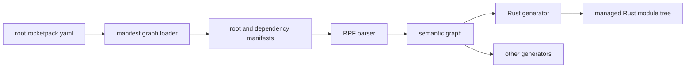

# RocketPack compiler の設計

## 1. このドキュメントについて

本書は RocketPack compiler における schema module、依存解決、シンボル解決、Rust module 生成の設計を定める。
想定読者は RPF の構成を決める利用者と、compiler および generator を変更する実装者である。

### 1.1 文書間の責務分担

| 文書または定義 | 責務 |
| --- | --- |
| 本書 | 構成要素の責務、不変条件、設計判断、採用理由、保留事項 |
| [ISSUES.md](../ISSUES.md) | 現行コードで確認した不具合と、その修正までの追跡 |
| [RPF parser](../../entrypoints/rocketpack-compiler/src/parser) | RPF の具象構文と AST の正本 |
| [rocketpack.yaml の例](../../entrypoints/rocketpack-compiled-example/rocketpack.yaml) | 利用可能な設定値の実例 |
| [README.md](../../README.md) | リポジトリ全体の入口と外部リンク |

本書は RPF のフィールド構文、wire encoding、CLI のセットアップ手順を複写しない。

### 1.2 本書の時制について

本文は設計上の完成形を現在形で記述する。
実装状況と依存順は §11 に集約する。

いま何が動くのかを知りたい場合は §11 を先に読む。

## 2. RocketPack compiler とは

RocketPack compiler は、1 個の root manifest と、その manifest が宣言する RPF schema module の依存グラフを意味解析し、言語別 generator へ一意に解決した型情報を渡すツールである。
ひとつの manifest は複数の RPF と複数の package を所有できるが、生成対象は root manifest が所有する RPF に限る。
path dependency により、ローカル filesystem 上にある別 crate の schema をコピーせず参照できる。

### 2.1 スコープ外

- registry、Git URL、version range、lockfile、依存キャッシュは扱わない。
  path dependency に限定することで、取得と version 選択の機構を持たず、利用側が用意したローカル schema を直接読む。
- dependency manifest の generator を実行しない。
  schema 依存と生成の副作用を分離することで、依存先の出力領域を変更しない。
- 推移 dependency を root から直接参照できるようにしない。
  直接 dependency の宣言を必須にすることで、依存先の内部実装変更を root の API から隔離する。
- Rust module を crate root より深い任意位置へ組み込まない。
  crate root 直下に固定することで、generator が出力する絶対 path と実際の module tree を一致させる。

## 3. 全体構成

### 3.1 コンポーネントとディレクトリ対応表

| パス | パッケージ名 | 役割 |
| --- | --- | --- |
| [entrypoints/rocketpack-compiler](../../entrypoints/rocketpack-compiler) | `omnius-core-rocketpack-compiler` | manifest の読み込み、RPF の意味解析、generator の実行 |
| [entrypoints/rocketpack-compiler/src/config.rs](../../entrypoints/rocketpack-compiler/src/config.rs) | `config` | manifest の構文モデルと path dependency graph の入口 |
| [entrypoints/rocketpack-compiler/src/parser](../../entrypoints/rocketpack-compiler/src/parser) | `parser` | RPF を source location 付き AST へ変換する |
| [entrypoints/rocketpack-compiler/src/semantic.rs](../../entrypoints/rocketpack-compiler/src/semantic.rs) | `semantic` | schema symbol の登録、可視性検証、型参照の解決 |
| [entrypoints/rocketpack-compiler/src/codegen](../../entrypoints/rocketpack-compiler/src/codegen) | `codegen` | semantic graph を言語別の生成物へ変換する |
| [entrypoints/rocketpack-compiled-example](../../entrypoints/rocketpack-compiled-example) | `rocketpack-compiled-example` | 生成物を実際の Rust crate へ組み込む結合検証 |
| [entrypoints/rocketpack-compiled-example/rust/gen](../../entrypoints/rocketpack-compiled-example/rust/gen) | 自動生成物 | generator が専有し、手で編集しない Rust source tree |

### 3.2 処理の流れ

依存の向きは manifest graph から semantic graph、generator の順であり、言語別設定は schema の同一性へ影響しない。



## 4. 中心概念

### 4.1 Manifest module

**Manifest module** は、1 個の `rocketpack.yaml` と、その `sources` が発見する RPF の集合である。
コード上では manifest の設定型と、読み込み後の module node が対応する。
RPF の `package` は型の論理的な名前空間であり、manifest module は依存と所有権の単位であるため、両者は同じものではない。

### 4.2 Schema dependency

**Schema dependency** は、manifest の top-level `dependencies` に名前付きで宣言する別 manifest への有向辺である。
外部表現は dependency 名と `path` であり、読み込み後は参照元と参照先の module identity を持つ辺になる。
YAML のマージや generator の継承は含まない。

### 4.3 Schema symbol

**Schema symbol** は、RPF item を `package::Item` で一意に識別した意味解析上の要素である。
コード上では定義元 module、定義元 RPF、item kind、source span を持つ symbol entry に対応する。
Rust path は generator が symbol entry から導出する派生値であり、schema symbol の identity には含まれない。

### 4.4 Semantic graph

**Semantic graph** は、読み込んだ全 manifest module、全 RPF、全 schema symbol、解決済み参照をまとめた言語非依存の中間表現である。
ファイル単位の AST と異なり、別 RPF および直接 dependency の symbol owner を問い合わせられる。
generator は未検証の RPF path を再解釈せず、この graph の解決結果だけを使う。

### 4.5 Rust module root

**Rust module root** は、Rust generator の `module_name` で指定し、利用 crate の crate root 直下へ組み込む公開 module である。
`module_name: rocketpack` ならローカル path の先頭は `crate::rocketpack` になる。
RPF package はこの root より下へ写像され、RPF ファイル名は公開 API に含まれない。

### 4.6 Language dependency mapping

**Language dependency mapping** は、schema dependency 名を generator 固有の外部名前空間へ対応させる設定である。
Rust では Cargo から見える crate identifier と、その crate が公開する RocketPack module 名を保持する。
top-level dependency が参照可能性を決めるのに対し、この mapping は生成コード内の path だけを決める。

## 5. Manifest dependency graph

各 manifest は `version: 1` と一意な `name` を必須とする。
dependency key は参照先 manifest の `name` と完全一致し、`path` は宣言元 manifest のディレクトリを基準に解決する。

```yaml
version: 1
name: omnius-app-protocol

dependencies:
  omnius-core-protocol:
    path: ../core-protocol/rocketpack.yaml
```

loader は canonical manifest path と宣言名を保持する。
同名 module が異なる canonical path を指す場合と、異名 module が同じ canonical path を指す場合は、どちらも identity の矛盾として失敗する。
同名同一 path へ複数経路が到達する diamond は、一つの node へ集約する。

各 module が参照できるのは、自身と直接 dependency の symbol だけである。
推移 dependency の RPF も graph の検証対象になるが、参照元 module が直接宣言していなければ名前解決候補に入らない。
循環は使用中の symbol の有無にかかわらず失敗し、診断は循環した module 名と manifest path の列を示す。

dependency manifest から取り込むのは `name`、`dependencies`、`sources` と RPF だけである。
dependency 側の `generators` と `targets` は実行も継承もしない。

## 6. Schema symbol と名前解決

すべての RPF は `package` を必須とする。
symbol の完全修飾名は package segment と item 名の連結であり、同じ graph に同名 symbol が複数存在すれば内容が同一でも失敗する。
診断は両方の module 名、RPF path、source location を示す。

単純名の探索順は、組み込み型、同一 RPF の item、同じ RPF の明示的な `use` binding の順である。
別 RPF の item は同じ package にあっても暗黙候補に加えない。
別 RPF を参照する側は `use package::Type`、alias 付き `use`、または field type の完全修飾名を記述する。

`use` と完全修飾参照は semantic graph 上で実在する symbol へ解決されなければ失敗する。
同じ単純名を作る複数の binding、ローカル item と binding の衝突、Rust identifier へ変換した後の公開名衝突も生成前に失敗する。
type alias の循環検出はファイル単位ではなく、解決済み symbol の参照列に対して行う。

## 7. Rust module tree

Rust generator は root manifest の全 `sources` を対象とし、`targets[].pattern` と `targets[].options.dir` で部分集合を作らない。
生成対象を変える場合は root manifest の `sources.includes` と `sources.excludes`、または manifest の分割を使う。

generator option は `output_dir` と `module_name` を必須とする。
`module_name` は Rust identifier として妥当であることを検証し、利用側は同名 module を crate root 直下で一度だけ宣言する。
`output_dir` は root manifest の directory 内に収まる相対 path に限定し、絶対 path、親 directory への traversal、symlink による領域外への逸脱を拒否する。

```yaml
generators:
  - id: rust
    plugin: rocketpack-rust
    options:
      output_dir: rust/gen/src
      module_name: rocketpack
```

```rust
#[path = "../gen/src/rocketpack.rs"]
pub mod rocketpack;
```

出力は `mod.rs` を使わず、Rust 2018 以降の `<module_name>.rs` と同名ディレクトリの規則に従う。
たとえば package `omnius::core::v1` は次の tree を形成する。

```text
rust/gen/src/
├── rocketpack.rs
└── rocketpack/
    ├── omnius.rs
    └── omnius/
        ├── core.rs
        └── core/
            ├── v1.rs
            └── v1/
                ├── source_1.rs
                └── source_2.rs
```

package module は内部 source module を非公開で宣言し、型を package module 直下へ公開再 export する。
内部 source module 名は正規化した module identity と RPF 相対 path から決定論的に作り、公開 API に現さない。
同じ package を複数 RPF が拡張しても、利用 path は `crate::rocketpack::omnius::core::v1::Type` のまま変わらない。

ローカル symbol の Rust path は `crate::<module_name>::<package>::<item>` である。
schema の `use` 文字列を Rust の `use` としてそのまま出力してはならない。
generator は解決済み symbol owner から local path または external path を選ぶ。

## 8. 生成物の所有と公開

Rust generator が永続生成物として所有するのは `<output_dir>/<module_name>.rs` と `<output_dir>/<module_name>/` だけである。
`output_dir` の兄弟ファイルは所有せず、削除しない。
所有領域には生成 marker を付け、手書き source を置かない。

公開処理中は `<output_dir>/.rocketpack-<module_name>.rs.backup`、`<output_dir>/.rocketpack-<module_name>.backup`、`<output_dir>/.rocketpack-<module_name>.stage-*` を制御用 path として予約する。
予約名自体を generator の一時所有領域として扱い、内部ファイルには generator marker を要求する。
空 directory は回復または削除できるが、symlink または marker のないファイルがあれば処理を拒否する。

意味解析、path 検証、全ファイルの render が成功するまで既存生成物を変更しない。
公開時は同じ filesystem 上の一時領域へ全生成物を置き、既存の専有領域を backup してから置換する。
置換中に失敗した場合は backup を復元し、次回実行時には中断した一時領域と backup を識別して回復または明示的に失敗する。
この置換は一時領域と出力先が同じ filesystem にあることを前提とし、別 filesystem をまたぐ出力は `output_dir` の制約により扱わない。

RPF や package を削除した後の stale source は、新しい tree に含まれないため置換とともに消える。
この性質は generator が専有領域以外を変更しない前提で成り立つ。

## 9. 外部 Rust 型の対応

Rust generator の `options.dependencies` は、top-level dependency 名を Cargo から見える crate identifier と公開 module 名へ割り当てる。

```yaml
generators:
  - id: rust
    plugin: rocketpack-rust
    options:
      output_dir: rust/gen/src
      module_name: rocketpack
      dependencies:
        omnius-core-protocol:
          crate: omnius_core_protocol
          module_name: rocketpack
```

dependency `omnius-core-protocol` が所有する `omnius::core::v1::UserId` は、`omnius_core_protocol::rocketpack::omnius::core::v1::UserId` へ写像される。
`crate` は Cargo package 名ではなく、依存 rename 適用後に Rust source から見える identifier である。

root の生成対象が dependency の symbol を使う場合だけ mapping を必須とする。
未使用 dependency の mapping は省略できる。
使用中の dependency に mapping がなければ、dependency 名、schema symbol、参照元 RPF を含む専用エラーで生成前に停止する。
top-level に存在しない dependency への mapping と、無効な Rust identifier は設定エラーにする。

## 10. 設計判断

### 10.1 決定済み

<a id="decision-manifest-dependencies"></a>
#### YAML の合成ではなく manifest dependency を採用する

**決定**
top-level `dependencies` は別 manifest の schema と再帰 dependency を読み込むが、設定 mapping と generator を取り込まない。

**理由**
schema の参照可能性と出力の副作用を分離し、依存先 crate の生成先を root から変更できないようにするためである。

**却下案**
YAML mapping の include と merge は、generator option の上書き順序と依存先への出力を発生させるため採用しない。

<a id="decision-direct-dependencies"></a>
#### 参照範囲を直接 dependency までに制限する

**決定**
各 manifest module は、自身と直接宣言した dependency の symbol だけを参照できる。

**理由**
推移 dependency を依存先の実装詳細に留め、直接使用する schema を manifest 上に表すためである。

**却下案**
graph 全体から名前を探索する方式は、dependency の内部変更だけで root の参照可能性が変わるため採用しない。

<a id="decision-symbol-identity"></a>
#### Schema symbol を package と item 名で一意化する

**決定**
すべての RPF に package を要求し、`package::Item` の重複と別 RPF の暗黙参照を禁止する。

**理由**
ファイル配置に依存しない公開 identity と、明示的な RPF 間依存を維持するためである。

**却下案**
同一 package の全 item を暗黙 scope に入れる方式は、ファイル追加により単純名の解決結果が変わるため採用しない。

<a id="decision-rust-module-tree"></a>
#### Rust generator が単一 module tree を所有する

**決定**
Rust generator は root の全 source を `<module_name>.rs` 形式の tree へ生成し、RPF ファイル名を公開 path に含めない。

**理由**
schema symbol と Rust path を一対一にし、同じ package を複数 RPF に分割しても公開 API を維持するためである。

**却下案**
RPF ごとの `targets[].dir` と inline `pub mod` は、利用 crate 内で実際に組み込まれる module root を generator が保証できないため採用しない。
`mod.rs` 形式は有効だが、同名ファイルが増え、Rust 公式が新しい命名規則を推奨しているため採用しない。

<a id="decision-language-mapping"></a>
#### 外部名前空間を generator option で割り当てる

**決定**
top-level dependency は言語非依存とし、外部 crate path は Rust generator の dependency mapping で指定する。

**理由**
Cargo dependency alias と Rust module 名は schema identity ではなく、生成先 crate ごとの事情だからである。

**却下案**
top-level dependency に Rust crate 名を置く方式は、C# や Swift の generator と設定責務が衝突するため採用しない。

### 10.2 保留

#### Remote dependency と lockfile

**現状**
dependency source はローカル filesystem 上の manifest path に限定する。

**なぜ今決めないか**
外部 Rust path の成立確認には path dependency で十分であり、配布、認証、version selection、キャッシュの設計を同時に持ち込む必要がないためである。

**決める条件**
同じ source tree に存在しない schema module を再現可能に取得する利用事例が発生したときに決める。

選択肢は次のとおりである。

1. 専用 registry と content digest を導入する。
   schema 向けの検証と配布を統合できるが、registry 運用が必要になる。
2. Git reference と lockfile を導入する。
   既存 Git hosting を使えるが、repository layout と認証方式に依存する。
3. Cargo package に schema を同梱して取得する。
   Rust では版を揃えやすいが、言語非依存の dependency manager ではなくなる。

#### Generator が複数の Rust module root を公開する場合

**現状**
1 generator は crate root 直下の module root を一つだけ生成する。

**なぜ今決めないか**
manifest を分ければ異なる module root を生成でき、現在の利用範囲では一つで足りるためである。

**決める条件**
同じ root manifest と同じ Rust crate で、独立した複数の公開 module root が必要になったときに決める。

## 11. 現状と残作業

現行実装は root と再帰的な path dependency から manifest graph と semantic graph を構築し、root が所有する全 RPF を一つの Rust module tree へ生成する。
同一 manifest の別 RPF は明示的な `use`、alias、完全修飾名で解決でき、直接 dependency の型は Rust generator の mapping により別 crate の公開型へ接続できる。
compiled example はローカルの複数 RPF と、Cargo dependency alias を使う provider/consumer の両方で encode と decode を検証する。

C# と Swift の generator は semantic graph への接続対象外であり、現行 compiler はそれらの generator 設定を実行せずに読み飛ばす。

ロードマップの順序は暫定であり、守る必要があるのは依存関係だけである。

| 番号 | 内容 | 前提とする依存 |
| --- | --- | --- |
| 1 | C# と Swift の generator を semantic graph と language dependency mapping へ接続する | 対象 generator の実装方針が決まること |
| 2 | Remote dependency と lockfile | §10.2 の決定条件が成立すること |

設計の参考として、Buf の [buf.yaml v2](https://buf.build/docs/configuration/v2/buf-yaml/) と [dependency management](https://buf.build/docs/bsr/module/dependency-management/) にある workspace と external dependency の責務分離を参照した。
Rust のファイル配置は [Rust Reference の module source filenames](https://doc.rust-lang.org/stable/reference/items/modules.html#module-source-filenames) に従う。

確認済みの不具合は [ISSUES.md](../ISSUES.md) に記載する。
