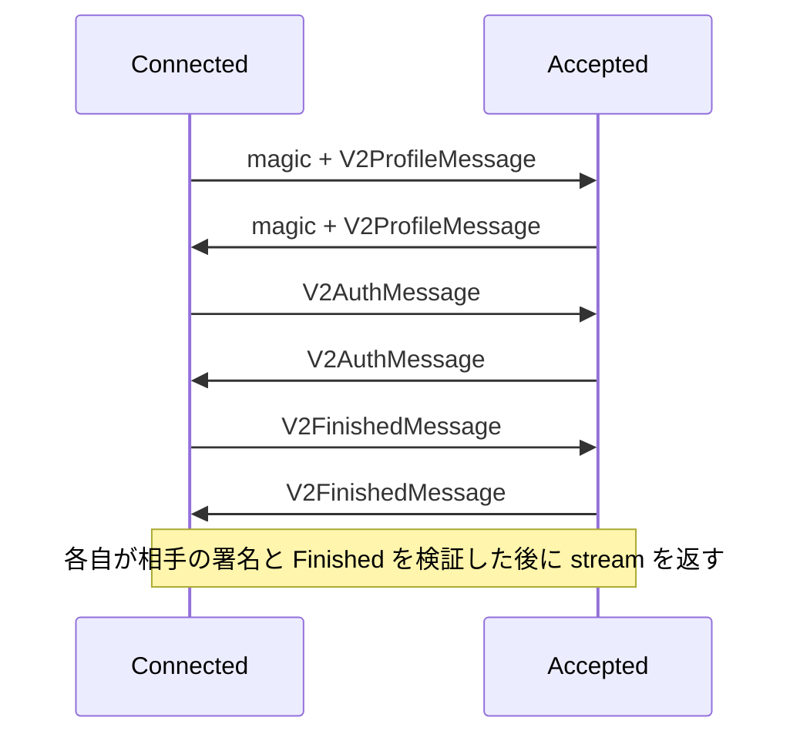

# OmniSecureStream V2 の設計

## 1. このドキュメントについて

本書は汎用 secure connection の handshake、認証結果、鍵導出、record と鍵更新の contract を定める。
本書は [terms.md](../terms.md#2-用語一覧) の語彙を前提とする。

### 1.1 文書間の責務分担

| 文書または正本 | 受け持つもの |
| --- | --- |
| 本書 | secure stream の不変条件、暗号手順、I/O と公開 API の contract |
| [DESIGN.md](../DESIGN.md#11-文書間の責務分担) | workspace と文書族の構成 |
| [terms.md](../terms.md#2-用語一覧) | 語義と API・wire 型の対応 |
| [omni_secure.rpf](../../modules/omnikit/rpfs/omni_secure.rpf) | handshake の型、field 番号、tag、長さと上限の定数 |
| [omni_sign.rpf](../../modules/omnikit/rpfs/omni_sign.rpf) | OmniCert と保存済み署名鍵の型 |
| [固定値の生成器](../../modules/omnikit/tests/fixtures/secure_v2_vectors.py) | 本書の計算を production code から独立して再現する参照コード |
| [固定値](../../modules/omnikit/tests/fixtures/secure_v2_vectors.json) | transcript、署名、鍵導出、record と更新の期待値 |

### 1.2 本書の時制について

本文は完成形を現在形で記述し、実装状況は §8 に集約する。
いま何が動くのかを知りたい場合は §8 を先に読む。

## 2. 責務と境界

V2 は順序を保つ双方向 byte stream の上で、暗号化通信と明示的な認証モードを提供する。
呼び出し側が transport、handshake 全体の期限、同時接続数、application の frame 上限、期待公開鍵と信頼 policy を所有する。

`OmniSecureAuth::Anonymous` は双方の署名を使わず、identity を保証しない。
`OmniSecureAuth::Mutual { signer }` は双方の Ed25519 署名を必須にする。
双方は同じモードを設定し、相手の申告を理由にモードを緩めない。
匿名モードは能動的な中間者への本人認証を保証しないため、認証が必要な利用側は Mutual を指定する。

constructor は context と認証モードを必須入力にする。
`OmniSecureStreamOption::new(context)` は既定の入力上限と更新しきい値を作る。
`new(stream, type, option, auth, rng)` は CSPRNG を要求し、設定を検査してから下位 stream を分割する。
context は 1〜256 byte の不透明な値であり、双方の値と呼び出し側の設定が byte 単位で一致しなければ拒否する。
公開 `new` は署名・鍵確認の完了後だけ stream を返す。
`peer_cert()` と `peer_public_key()` は Mutual で認証した OmniCert とその DER 公開鍵を返し、Anonymous では None を返す。
`handshake_hash()` は §4 の最終 hash を返す。
署名鍵の保存形式、Ed25519 公開鍵の DER 表現と signer の name は変えない。
Mutual の利用側は、返された認証済み DER 公開鍵を期待公開鍵・信頼 policy と照合し、成功するまで application の送受信を始めない。
不一致なら stream を破棄する。
core の constructor は相手の鍵所持を検証し、node の探索や利用側の許可判断を代行しない。

## 3. handshake

### 3.1 version、暗号方式と入力境界

V2 の暗号方式は X25519、HKDF-SHA3-256、AES-256-GCM、Ed25519 に固定する。
algorithm flags の交渉と旧形式への fallback は行わない。
最初に各方向が送る byte 列は ASCII `OMNISC2` と NUL の 8 byte であり、その後に平文の長さ区切り handshake frame を送る。
frame は little-endian u32 の payload 長と RocketPack payload からなる。
payload 長は呼び出し側の指定値以下かつ 16 KiB 以下とし、header を読む段階で検査する。

各 handshake payload は生成 codec の decode 後に再 encode して同じ byte 列になることを要求する。
未知・重複・欠落 field、非最小整数表現、異なる map 順、余分な末尾 byte は拒否する。
この wire の正規形検査と、§3.3 の意味的 field の署名対象は別の contract である。
生成 decoder の前に、固定 schema が使う unsigned integer、bytes、text、map だけを検査し、nest の深さを 4、map の entry 数を 8 以下に制限する。
未知 field を読み飛ばす decoder の再帰へ、深い入力を渡さない。

V2ProfileMessage は version 2、接続方向の role、AuthType、context、32 byte の nonce、32 byte の ephemeral DH 公開鍵、name と identity 公開鍵を運ぶ。
Connected の role tag は 1、Accepted は 2、Anonymous の AuthType tag は 1、Mutual は 2 とする。
自分と相手の role は逆でなければならない。
nonce と ephemeral private key は接続ごとに CSPRNG から新しく生成し、接続の再試行でも再利用しない。

Mutual の identity 公開鍵は、Ed25519 の正規 SubjectPublicKeyInfo DER の 44 byte とする。
先頭 12 byte は `302a300506032b6570032100`、残りは Ed25519 公開鍵の 32 byte である。
name は UTF-8 の 0〜256 byte をそのまま使い、正規化しない。
identity 公開鍵は正規の Ed25519 point として検査し、弱い公開鍵を拒否する。
Anonymous は name と identity 公開鍵を空にし、V2AuthMessage の cert を None にする。
Mutual の cert は対応する profile と同じ name・公開鍵、Ed25519 の type tag 2、64 byte の署名を持つ。
認証モードの policy、context、version、role、鍵長・形式の違反は、相手に署名を返す前に拒否する。
X25519 の共有秘密が全ゼロなら、両モードとも拒否する。

### 3.2 順序と公開時点

Connected を I、Accepted を R とし、各 send は次の段階へ進む前に flush する。

相手の profile を読んでから返す順序にすることで、小さな transport buffer でも双方の大きな同時 write が handshake を止めない。
Mutual は相手の cert と profile の対応を検査し、署名を検証してから Finished を処理する。
R は I の Auth の検証後に自分の Auth を送り、I は R の Auth の検証後に Finished を送る。
R は I の Finished を検証してから自分の Finished を送り、I は R の Finished を検証する。
R の返却は自分の Finished の flush 後、I の返却は相手の Finished の検証後とする。
application record をそれより前に送らない。
失敗は接続を fatal にし、署名や復号を再試行せず下位 transport を閉じる。

### 3.3 意味的な署名対象

`LE32(x)` と `LE64(x)` は符号なし整数の little-endian 表現、`LP(x)` は `LE32(len(x)) || x`、`H(x)` は SHA3-256 とする。
hash の label は ASCII 表記の末尾へ NUL を 1 byte 追加する。
profile の意味的 byte 列 `P` は次の順に連結する。

1. `LE32(version)`、role tag の 1 byte、AuthType tag の 1 byte
2. `LP(context)`、nonce の 32 byte、ephemeral DH 公開鍵の 32 byte
3. `LP(name の UTF-8)`、`LP(identity DER 公開鍵)`

`T0 = H("omnius.secure.v2/hello\0" || LP(P_I) || LP(P_R))` とする。
署名する値は `"omnius.secure.v2/signature\0" || role の 1 byte || T0` であり、hash の 32 byte だけには署名しない。
Ed25519 の署名・検証はこの値を直接入力とし、別の事前 hash を追加しない。
署名検証は `verify_strict` 相当の厳密な検査を使い、非正規な scalar と小位数の署名 point を受理しない。
Connected と Accepted の順序は、送受信順序や map の順序によって変えない。

意味的な auth byte 列 `A` は None なら 1 byte の 0、Some なら 1 byte の 1 に `LE32(cert type tag)`、`LP(name)`、`LP(public_key)`、`LP(signature)` を続ける。
`T1 = H("omnius.secure.v2/auth\0" || T0 || LP(A_I) || LP(A_R))` とする。
署名の preimage は RocketPack の export 全体に依存しないが、認証の完了と鍵導出には実際に検証した双方の cert を含める。

## 4. 鍵導出と鍵確認

### 4.1 導出

HKDF は HMAC-SHA3-256 を使い、HashLen は 32 byte とする。
`Extract(salt, input)` は `HMAC(salt, input)`、`Expand(prk, info, n)` は RFC 5869 の HKDF-Expand とする。
次の順に計算する。

1. X25519 の共有秘密 `Z` を計算し、全ゼロを拒否する。
2. `PRK = Extract(T0, Z)` を求める。
3. `F_I = Expand(PRK, "omnius.secure.v2/finished/initiator\0" || T1, 32)` を求める。
4. `F_R = Expand(PRK, "omnius.secure.v2/finished/responder\0" || T1, 32)` を求める。
5. `V_I = HMAC(F_I, "omnius.secure.v2/verify/initiator\0" || T1)` を求める。
6. `V_R = HMAC(F_R, "omnius.secure.v2/verify/responder\0" || T1 || V_I)` を求める。

V2FinishedMessage の verify_data は、その role の `V_I` または `V_R` の 32 byte と一致しなければならない。
HMAC の比較と全ゼロの検査は、秘密の値による早期終了を避ける。
最終 hash は `T2 = H("omnius.secure.v2/session\0" || T1 || V_I || V_R)` とする。

送信方向 I→R は direction tag 1、R→I は 2 とする。
世代 0 の方向別秘密は、I→R が `Expand(PRK, "omnius.secure.v2/traffic/initiator-to-responder\0" || T2, 32)`、R→I が `Expand(PRK, "omnius.secure.v2/traffic/responder-to-initiator\0" || T2, 32)` である。

各方向の秘密を `S_g`、世代を `g` とすると、AES key と base IV は次のとおりである。

- `K_g = Expand(S_g, "omnius.secure.v2/key\0" || T2 || direction || LE64(g), 32)`
- `IV_g = Expand(S_g, "omnius.secure.v2/iv\0" || T2 || direction || LE64(g), 12)`

### 4.2 秘密の寿命

ephemeral private key と Z は PRK の生成後に破棄する。
PRK と Finished 用鍵は双方の Finished の検証、方向別秘密と世代 0 の鍵・IV の導出後に破棄する。
失敗経路でも同じ秘密を破棄し、debug・trace・error に plaintext、鍵、nonce の秘密入力を出さない。
保存するのは現在の方向別秘密、鍵・IV、認証した相手の cert、T2 と送受信状態である。
世代の更新時は旧秘密、旧鍵・IV と一時導出値を破棄する。
zeroize を使い、AEAD primitive 内部の鍵 schedule も含めて破棄できる経路を実装で確認する。
AES-GCM 0.11、GHASH 0.6 と固定した POLYVAL 0.7.3 の zeroize feature を使い、cipher が保持する GHASH 状態へ通常の Drop から到達する構成を両 workspace で確認する。
normal Drop の存在を回帰試験で検査し、消去内容は固定した backend の source と feature graph を根拠にする。
zeroize は process dump や OS による複製の消去まで保証するものではない。
永続 identity の署名鍵は呼び出し側の寿命に従い、handshake 用の一時 copy の破棄と区別する。

## 5. record と rekey

### 5.1 record

record は 21 byte の header と AES-256-GCM の暗号文・128 bit tag からなる。
header の順序は kind の 1 byte、`LE64(generation)`、`LE64(sequence)`、`LE32(ciphertext_length)` とする。
kind は rpf の Data=1、KeyUpdate=2、Close=3 とする。
nonce は `IV_g XOR (0 の 4 byte || sequence の big-endian 8 byte)` とし、wire に載せない。
AAD は `"omnius.secure.v2/record\0" || T2 || direction の 1 byte || header` とする。
暗号文の長さは plaintext 長に tag の 16 byte を加えた値である。

Data の plaintext は 1〜65,536 byte、KeyUpdate は次世代番号の `LE64(g + 1)` の 8 byte、Close は空とする。
kind に合わない長さ、65,552 byte を超える暗号文長、期待しない世代・sequence は payload の確保前に拒否する。
各方向の世代と sequence は 0 から始め、同じ世代では Data、KeyUpdate、Close のすべてで sequence を 1 ずつ進める。
認証 tag に失敗した接続は直ちに fatal とし、同じ鍵で別の候補を試さない。
record の構造・状態・使用量違反、不正な KeyUpdate、認証した Close 前の物理 EOF、継続不能な transport エラーも接続全体を fatal にする。
fatal 後は両方向で新しい record 処理・送信・plaintext の公開を行わず、秘密を破棄して下位 stream を破棄する。
両方向の Pending operation の waker も起こし、下位 transport の Drop に通知を任せない。
拒否した payload の残りから record 境界を探し直したり、次の read を通常どおり続けたりしない。

### 5.2 使用量と通知分の予約

wire 上の上限は各方向・各鍵世代で plaintext 合計 `B = 2^30` byte、record 数 `R = 2^20` とする。
合計には KeyUpdate の 8 byte と Close も含め、header と tag は plaintext 合計に含めない。
Data は常に 8 byte と 1 record の余裕を残し、累積 plaintext が `B - 8` 以下、累積 record 数が `R - 1` 以下になる範囲で送受信する。
送信する Data はその残量と 65,536 byte 以下へ分割する。

送信側は次の Data の余裕がなくなったら、予約した範囲で KeyUpdate を送る。
送信側の更新しきい値だけは、byte 数を 9〜B、record 数を 2〜R に下げて設定できる。
低いしきい値は試験と早い更新に使い、peer にしきい値の一致を要求しない。
受信側は固定した wire 上限を検査する。
KeyUpdate は同じ世代で少なくとも 1 つの Data を認証した後だけ受理し、データなしの連続更新を拒否する。

### 5.3 切り替え

KeyUpdate は旧鍵、旧世代、旧 sequence で暗号化する。
次世代の秘密は `S_(g+1) = Expand(S_g, "omnius.secure.v2/update\0" || T2 || direction || LE64(g + 1), 32)` とし、§4.1 から新しい鍵と IV を導出する。
新世代の sequence と使用量は 0 に戻す。
`g + 1` が u64 に収まらない場合は更新せず接続を閉じる。

送信側は更新 record 全体を下位 writer に順番どおり渡した後に送信状態を新世代へ切り替える。
partial write の途中で新世代の Data を挟まず、Pending で戻った後も同じ旧鍵の暗号文の送信を継続する。
受信側は更新 record の tag、使用量、次世代が `g + 1` であることを検査してから受信状態を切り替える。
確認応答は使わず、反対方向の状態を変更しない。
双方の同時更新にも同じ規則を適用する。
通常の更新に新規 DH 交換は含めないため、方向別秘密の漏えい後に秘密を回復することは保証しない。

### 5.4 鍵使用量の評価

1 record の plaintext は 2^16 byte 以下であり、GCM の record 内 counter の上限に達しない。
固定 AAD は 78 byte、GHASH の入力は AAD の 5 block、plaintext の切り上げ block 数、長さの 1 block である。
1 世代の plaintext が 2^30 byte 以下、record 数が 2^20 以下なので、切り上げ分も含む GHASH 入力の合計は `2^26 + 7 × 2^20 < 2^27` block である。
128 bit tag を切り詰めず、失敗した復号を 1 回で fatal にする。
同じ世代の nonce は sequence によって一意になり、更新後は異なる秘密・鍵と IV を導出する。

[RFC 8446 §5.5](https://www.rfc-editor.org/rfc/rfc8446.html#section-5.5) は AES-GCM の鍵使用量制限と限界前の更新を要求する設計根拠になる。
同節の TLS record に対する確率評価は record サイズと protocol が異なるため、そのまま V2 の安全性確率として引用しない。
上の計算は使用量と入力上限の確認であり、handshake、HKDF と複数世代を含む protocol 全体の安全性証明ではない。
固定値の生成器もこの入力上限を検査する。

## 6. I/O と終了

read buffer の残量が 0 なら、下位 I/O を呼ばず成功を返す。
通常の read は認証した Data の plaintext だけを返し、KeyUpdate と Close は内部で処理する。
Close は tag を検証した後に EOF へ遷移する。
認証した Close より前の物理 EOF は、record の境界でも途中でも UnexpectedEof とし、truncation を成功扱いしない。
受信済み Data の残量がある場合は先に返す。

空の write は 0 を返して Data を作らない。
空の flush は空の record を作らず、下位 writer の flush だけを呼ぶ。
非空の送信で 0 byte の write が返れば WriteZero とし、offset が進まない loop を続けない。
partial I/O と Pending を state に残し、送信済み byte を作り直した nonce で再送しない。
暗号文へ変換した plaintext は再暗号化せず、確定した暗号文の未送信 suffix だけを継続する。

shutdown は受け付け済みの Data と必要な更新を送り、Close を 1 回だけ送り、flush 後に下位 writer を shutdown する。
送信終了後の write は BrokenPipe とし、反対方向の受信を自動的には終了させない。
Drop は Close の送信を保証しない。
handshake 用 framed reader を取り外す際は、先読みした raw byte を record reader へ引き継ぐ。
read_exact だけを使って先読みしない場合も、同じ underlying stream の所有権を保持する。

### 6.1 cancellation と timeout

constructor は下位 stream を所有し、handshake future の中断・期限切れではその stream と一時秘密を破棄する。
途中の transport を使って handshake を再開しない。

確立後の暗号文、offset、受信途中の header/body、使用量、更新と終了の状態は操作 future ではなく stream が所有する。
poll が Pending なら、その呼び出しでは新しい application 入力を消費せず、出力 buffer に plaintext を公開しない。
write は受け付けた byte 数を Ready で返し、その後の Pending は既に受け付けた出力の送信を待つ。
操作 future を中断しても、新しい poll は保持した暗号文と offset を継続し、再暗号化、sequence の二重進行、KeyUpdate と Close の重複を起こさない。
shutdown の開始後は Closing の状態を維持し、中断後も新しい write を拒否する。
再度の shutdown は未完了の送信・Close・下位 shutdown を継続する。
下位 shutdown を開始した後はその段階を保持し、Pending 後に下位 flush をやり直さない。
この段階の公開 flush は既に完了した Data と Close の flush を重複させない。

Ready で受け付けた入力と公開した出力は中断後に巻き戻さない。
read_exact・write_all のような複合操作を中断した呼び出し側は、完了済み prefix の進捗を保持するか、接続を破棄する。
進捗が分からないまま同じ application message 全体を送り直すことは、stream の cancellation contract に含めない。

## 7. 設計判断

### 7.1 決定済み

#### 相互署名と匿名を接続前に固定する

**決定**
§2 の認証モードと context は必須の constructor 入力にし、相手の profile から選び直さない。
新形式だけを受理し、旧署名対象と algorithm flags を V2 の認証へ流用しない。

**理由**
暗号化の確立と期待する認証強度を別に設定し、peer が弱い設定へ変更することを防ぐためである。

**却下案**
signer の有無から暗黙に決める方式は、相手の署名が省略されても constructor が成功するため採らない。

#### 意味的 field と双方の役割へ署名を束縛する

**決定**
§3.3 の field を固定順で符号化し、domain label と role を含む値へ署名する。
cert、Finished、方向別秘密と record にも接続の hash を引き継ぐ。

**理由**
片側の情報だけへの署名流用、役割の反射、別の接続・context への record 流用を防ぐためである。

**却下案**
署名者側の hash のみを使う旧形式と、wire export 全体を preimage にする方式は採らない。
後者は schema の表現変更だけで署名対象まで変えるためである。

#### 方向別の通知と認証した終了を record に含める

**決定**
KeyUpdate は旧鍵で保護し、順序のある stream 上で次の record から新鍵を使う。
EOF は認証した Close からだけ公開する。

**理由**
反対方向の通信を止めずに更新し、buffer の欠落と transport の切断を正常終了に見せないためである。

**却下案**
両方向の更新を同期する方式は同時要求と確認応答を増やすため採らない。
物理 EOF を正常終了にする方式は最後の record の切り落としを検出できないため採らない。

### 7.2 保留

本書の対象とする V2 の wire、署名、鍵確認と更新境界に保留はない。
実装と攻撃試験の未達は §8 が扱う。

## 8. 現状と残作業

V2 の schema、詳細仕様と固定値を追加した。
両モードの DH、transcript、鍵導出と record、Mutual の署名を独立した Rust 計算と照合し、生成 codec の handshake wire の往復を確認した。
固定値を読む Rust の継続試験も追加し、core-rs と利用側 workspace の双方で成功した。
V2 の相互認証・鍵確認・record・方向別 rekey と I/O を実装した。
constructor は context と明示モードを使い、相手の認証済み証明書・公開鍵と最終 hash を取得できる。
固定値と実行時の handshake・record の一致、両方向の通信、更新予約の境界、partial I/O、cancellation、Close、fatal の伝播を確認した。
深い未知 CBOR を decoder 前に拒否することと、GHASH の normal Drop 経路も検査した。
nonce、正常 DH、name・identity と role の変更、別接続の Auth と旧署名の流用、DH を差し替える中継を constructor 経由で拒否する試験を追加した。
両認証モードと両 role の handshake の各読取・送信・flush 段階で、公開前の Pending、中断・timeout・途中 EOF と transport の破棄を確認した。
KeyUpdate の認証と世代・sequence・使用量の境界、受け付け済み Data からの shutdown 中断、下位 I/O fault、最大 record と frame 内での鍵更新も試験した。
使用量と世代の枯渇は、実際に上限量を送る代わりに境界直前の状態を設定して検査した。
両 workspace の lint と omnikit 試験、利用側の既存 engine・daemon 試験が成功し、定めた受け入れ条件への独立監査は pass した。
利用側での期待公開鍵・trust policy の照合と接続への統合は、利用側が所有する作業として残る。
これらの確認は protocol 全体の安全性証明を意味しない。

V2 を変更する場合も次の依存順を守る。表の順序は暫定であり、守る必要があるのは依存関係である。

| 番号 | 内容 | 前提とする依存 |
| --- | --- | --- |
| 1 | 詳細仕様、schema と固定値を独立検証する | 本書 |
| 2 | V2 の認証・record・I/O を一体で改修する | 1 |
| 3 | 攻撃、cancellation、使用量と終了の境界を試験する | 2 |
| 4 | 検証済みの V2 API を利用側へ提供する | 3 |

確認済みの不具合は [ISSUES.md](../ISSUES.md) を参照する。
